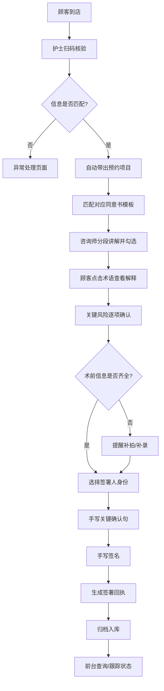

## 1. 产品概述

医美机构术前知情同意签署管理系统，面向咨询师、护士及现场顾客，通过数字化流程替代纸质同意书签署，提升前台工作效率与合规性。

- 解决传统纸质签署效率低、归档难、风险告知不规范等痛点
- 核心价值：签署流程标准化、风险留痕可追溯、查询检索高效化

## 2. 核心功能

### 2.1 用户角色

| 角色 | 使用场景 | 核心权限 |
|------|----------|----------|
| 咨询师 | 讲解项目风险、协助勾选已讲内容 | 选择项目、勾选讲解项、查看术语库 |
| 护士 | 核验顾客身份、补录术前信息 | 扫码核验、提醒照片/病史、归档查询 |
| 顾客 | 阅读同意书、确认风险、电子签署 | 查看术语解释、手写签名、领取回执 |
| 前台 | 查询签署状态、处理异常情况 | 多条件检索、异常标记、进度跟踪 |

### 2.2 功能模块

1. **顾客核验页面**：扫码读取预约、身份信息核对、快捷手动输入
2. **项目选择页面**：本次项目自动带出、对应同意书模板匹配、项目确认
3. **风险讲解页面**：分段勾选讲解、术语通俗解释、关键风险标记
4. **电子签署页面**：签署人类型选择、术前信息补全提醒、手写签名板、关键句手写确认
5. **归档查询页面**：多条件筛选、签署状态标识、快速定位未完成
6. **异常处理页面**：异常类型登记、处理记录、重新发起流程

### 2.3 页面详情

| 页面名称 | 模块名称 | 功能描述 |
|---------|---------|---------|
| 顾客核验 | 扫码区域 | 支持扫描预约二维码自动填充顾客信息 |
| 顾客核验 | 信息核对卡 | 显示姓名、手机号、身份证后四位，支持手动修改 |
| 顾客核验 | 核验按钮 | 信息确认后进入下一步，异常可跳转异常处理 |
| 项目选择 | 本次项目列表 | 根据预约自动带出玻尿酸/光电/埋线等项目 |
| 项目选择 | 同意书预览 | 展示所选项目对应的知情同意书模板列表 |
| 项目选择 | 确认提交 | 确认项目后进入风险讲解环节 |
| 风险讲解 | 分段内容区 | 适应症、禁忌症、恢复期、并发症四大模块 |
| 风险讲解 | 讲解勾选栏 | 咨询师逐段勾选"已向顾客讲解"复选框 |
| 风险讲解 | 术语提示 | 专业术语高亮可点击，弹出通俗解释浮层 |
| 风险讲解 | 关键风险标记 | 高风险项红色标记，记录顾客确认状态 |
| 电子签署 | 签署人选择 | 本人/监护人/代签人三种身份切换 |
| 电子签署 | 术前检查清单 | 术前照片、过敏史、用药史三项自动检查 |
| 电子签署 | 关键句手写区 | 顾客手写"我已充分了解上述风险"确认句 |
| 电子签署 | 签名板 | 触屏/鼠标手写签名区域，支持清除重签 |
| 电子签署 | 签署提交 | 生成唯一签署编号，下载签署回执 |
| 归档查询 | 筛选条件 | 日期范围、主治医生、项目类型、签署状态 |
| 归档查询 | 结果列表 | 顾客信息+项目+状态+签署时间，未完成红色高亮 |
| 归档查询 | 状态追踪 | 显示当前节点和下一步操作建议 |
| 归档查询 | 详情查看 | 查看完整签署记录和签名图片 |
| 异常处理 | 异常登记 | 选择异常类型（信息不符/放弃签署/设备故障等） |
| 异常处理 | 处理记录 | 记录处理人、处理时间、处理措施 |
| 异常处理 | 流程重启 | 支持异常解除后重新发起签署流程 |

## 3. 核心流程

顾客到店后，护士扫码核验身份 → 系统自动带出本次预约项目 → 咨询师选择对应同意书并分段讲解（顾客可点击术语查看通俗解释） → 确认关键风险 → 签署前系统自动检查术前照片、过敏史、用药史是否补齐 → 选择签署人类型（本人/监护人/代签） → 顾客手写关键风险确认句 + 手写签名 → 提交后生成签署回执 → 前台可在归档查询中按多条件检索，未完成项红色标记并提示下一步操作。

## 4. 用户界面设计

### 4.1 设计风格
- **主色调**：深青色 `#0F766E`（专业、可信）作为主色，珊瑚橙 `#F97316` 作为警示强调色
- **辅助色**：浅灰背景 `#F8FAFC`，白色卡片，成功绿 `#10B981`，错误红 `#EF4444`
- **按钮风格**：圆角 8px，主按钮实色填充，次要按钮描边风格
- **字体**：中文使用 `PingFang SC` / `Microsoft YaHei`，数字使用 `JetBrains Mono`，标题加粗、正文常规
- **布局风格**：顶部导航 + 卡片式分区，左侧进度指示条，信息密度适中
- **图标风格**：线性图标（Lucide React），20px 尺寸，线条粗细 1.5px

### 4.2 页面设计概要

| 页面名称 | 模块名称 | UI 要素 |
|---------|---------|---------|
| 顾客核验 | 扫码区域 | 大尺寸扫码框动画、手动输入切换按钮 |
| 顾客核验 | 信息核对卡 | 三列信息卡片（姓名/手机/身份证），勾选确认按钮 |
| 项目选择 | 项目卡片 | 项目图标+名称+类别标签，选中态深青色边框 |
| 项目选择 | 同意书列表 | 文件图标+模板名称+适用项目说明 |
| 风险讲解 | 分段折叠面板 | 手风琴布局，每段标题含讲解勾选框，已讲解绿色对勾 |
| 风险讲解 | 术语弹出层 | 点击术语后右侧滑出面板，专业词+通俗解释+示意图 |
| 风险讲解 | 关键风险区 | 橙色边框卡片，独立勾选，需顾客本人确认 |
| 电子签署 | 术前检查清单 | 三项状态图标列表（已完成✓/未完成✗橙色提示） |
| 电子签署 | 签署人切换 | 分段控件 Tab 切换，代签人需填写关系 |
| 电子签署 | 签名板 | 深色边框 Canvas 区域，工具栏含清除/撤销/完成 |
| 电子签署 | 关键句输入 | 田字格手写区域，预设文字描红引导 |
| 归档查询 | 筛选栏 | 行内筛选条件 + 查询按钮 + 重置按钮 |
| 归档查询 | 结果表格 | 斑马纹表格，未完成行红色背景，状态列彩色标签 |
| 归档查询 | 进度提示 | Tooltip 展示当前节点和下一步建议 |
| 异常处理 | 异常表单 | 异常类型下拉 + 描述文本域 + 上传凭证按钮 |
| 异常处理 | 处理时间线 | 左侧竖线时间轴，节点图标+处理人+时间+措施 |

### 4.3 响应式设计
- 桌面端优先（1440px 基准），适配 1280px~1920px 常用分辨率
- 签名板区域支持触屏设备（平板/签字屏），触摸事件优化
- 筛选栏在小屏幕折行显示，表格横向滚动条
- 术语解释面板移动端改为底部弹层

### 4.4 动效与交互
- 页面切换：淡入 + 轻微上移（200ms 缓动）
- 勾选讲解项：复选框缩放 + 绿色对勾绘制动画
- 签名开始：签名板边框高亮脉动
- 未完成项：红色标记轻微呼吸闪烁（每 3s 一次）
- 扫码成功：绿色圆圈对勾动画
