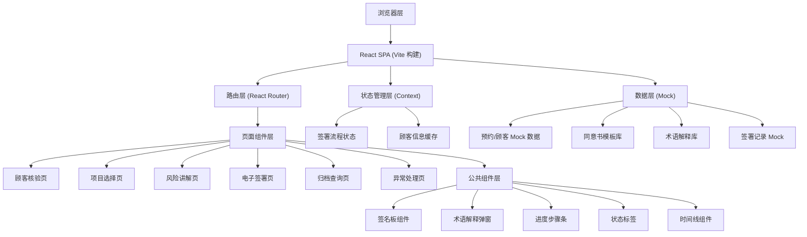

## 1. 架构设计

本项目为纯前端单页应用（SPA），采用 React 组件化架构，Mock 数据模拟后端，内置 Canvas 手写签名组件。状态管理使用 React Context + useReducer，无需额外引入 Redux 等重量级库。



## 2. 技术说明

- **前端框架**：React@18 + TypeScript@5
- **构建工具**：Vite@5
- **样式方案**：Tailwind CSS@3（CSS-in-CSS 辅助使用）
- **路由管理**：React Router DOM@6
- **图标库**：Lucide React
- **手写签名**：原生 Canvas API 封装（自研轻量组件）
- **Mock 数据**：TypeScript 常量文件 + Faker.js 生成随机数据
- **代码规范**：ESLint + Prettier

## 3. 路由定义

| 路由 | 页面 | 说明 |
|------|------|------|
| `/` | 顾客核验页 | 默认首页，扫码/手动输入核验 |
| `/projects` | 项目选择页 | 确认本次项目和对应同意书 |
| `/risk-explain` | 风险讲解页 | 分段讲解、术语解释、关键风险确认 |
| `/sign` | 电子签署页 | 签署人选择、术前检查、手写签名 |
| `/archive` | 归档查询页 | 多条件筛选和签署状态跟踪 |
| `/exception` | 异常处理页 | 异常登记和流程重启 |

## 4. 数据模型（TypeScript 类型定义）

### 4.1 核心数据类型

```typescript
// 顾客信息
interface Customer {
  id: string;
  name: string;
  phone: string;
  idCardLast4: string;
  fullIdCard?: string;
  appointmentId: string;
  appointmentDate: string;
  doctor: string;
}

// 医美项目
interface ProjectItem {
  id: string;
  name: string;
  category: 'hyaluronic' | 'photoelectric' | 'thread' | 'other';
  categoryLabel: string;
  consentTemplateId: string;
}

// 同意书模板
interface ConsentTemplate {
  id: string;
  name: string;
  applicableProjects: string[];
  sections: ConsentSection[];
}

// 同意书分段
interface ConsentSection {
  id: string;
  title: '适应症' | '禁忌症' | '恢复期' | '并发症';
  content: string;
  keyTerms: TermRef[];
  isKeyRisk: boolean;
}

// 术语引用
interface TermRef {
  word: string;
  termId: string;
}

// 术语解释
interface Term {
  id: string;
  word: string;
  simpleExplanation: string;
  detailExplanation?: string;
  illustrationUrl?: string;
}

// 签署人类型
type SignerType = 'self' | 'guardian' | 'representative';

// 签署记录
interface SignRecord {
  id: string;
  customerId: string;
  customerName: string;
  projectIds: string[];
  projectNames: string[];
  doctor: string;
  signerType: SignerType;
  signerName: string;
  guardianRelation?: string;
  explainedSections: string[];
  confirmedKeyRisks: string[];
  keySentenceSignature: string; // base64
  customerSignature: string; // base64
  preOpPhotoDone: boolean;
  allergyHistoryDone: boolean;
  medicationHistoryDone: boolean;
  status: 'pending' | 'explaining' | 'ready_to_sign' | 'completed' | 'exception';
  currentStep: number;
  nextAction: string;
  signTime?: string;
  createTime: string;
  exceptionId?: string;
}

// 异常记录
interface ExceptionRecord {
  id: string;
  customerId: string;
  signRecordId?: string;
  type: 'info_mismatch' | 'customer_refused' | 'device_failure' | 'incomplete_info' | 'other';
  typeLabel: string;
  description: string;
  handler: string;
  handleTime: string;
  measures: string;
  resolved: boolean;
  resolvedTime?: string;
}
```

### 4.2 全局状态（Context）

```typescript
interface AppState {
  currentCustomer: Customer | null;
  selectedProjects: ProjectItem[];
  currentTemplate: ConsentTemplate | null;
  explainedSections: string[]; // 已讲解的分段 ID
  confirmedKeyRisks: string[];
  preCheckStatus: {
    photo: boolean;
    allergy: boolean;
    medication: boolean;
  };
  signerType: SignerType;
  signerName: string;
  guardianRelation: string;
  keySentenceDataUrl: string | null;
  signatureDataUrl: string | null;
  currentRoute: string;
}
```

## 5. 项目目录结构

```
src/
├── assets/              # 静态资源
│   └── styles/          # 全局样式、Tailwind 导入
├── components/          # 公共组件
│   ├── SignaturePad/    # 签名板组件
│   ├── TermModal/       # 术语解释弹窗
│   ├── StepIndicator/   # 步骤进度条
│   ├── StatusBadge/     # 状态标签
│   ├── Timeline/        # 时间线
│   ├── NavBar/          # 顶部导航
│   └── PageTransition/  # 页面过渡动效
├── pages/               # 页面组件
│   ├── CustomerVerify/  # 顾客核验
│   ├── ProjectSelect/   # 项目选择
│   ├── RiskExplain/     # 风险讲解
│   ├── ESign/           # 电子签署
│   ├── Archive/         # 归档查询
│   └── Exception/       # 异常处理
├── data/                # Mock 数据
│   ├── customers.ts
│   ├── projects.ts
│   ├── templates.ts
│   ├── terms.ts
│   └── records.ts
├── types/               # TypeScript 类型定义
│   └── index.ts
├── context/             # 状态管理
│   └── SignFlowContext.tsx
├── hooks/               # 自定义 Hooks
│   ├── useSignature.ts
│   └── useScanSimulate.ts
├── utils/               # 工具函数
│   ├── idGenerator.ts
│   └── dateFormat.ts
├── App.tsx
├── main.tsx
└── vite-env.d.ts
```

## 6. 关键技术实现要点

### 6.1 手写签名板（自研 Canvas 组件）
- 监听 mousedown/mousemove/mouseup 和 touchstart/touchmove/touchend
- 使用 quadraticCurveTo 绘制平滑曲线而非直线段
- 记录笔画历史栈，支持撤销操作
- 输出 PNG base64 格式（压缩质量 0.92）
- 签名板尺寸自适应容器宽度，比例锁定 3:1

### 6.2 术语高亮与交互
- 同意书内容渲染时按 `TermRef` 中的关键词进行正则替换
- 替换为可点击的 `<span>` 标签，样式为下划线+浅蓝背景
- 点击后渲染右侧抽屉（Drawer）组件，展示通俗解释
- 支持一次打开多个术语解释，标签页切换

### 6.3 签署状态流转
- 使用有限状态机思想：`pending → explaining → ready_to_sign → completed`
- 每一步跳转前校验前置条件是否满足（用 `canProceed` 工具函数）
- 未完成项在归档页以 `#FEE2E2` 红色背景 + `animate-pulse` 闪烁提示

### 6.4 术前信息检查
- 使用 React Effect 监听 `preCheckStatus` 状态变化
- 任意一项未完成时按钮禁用并在下方显示橙底提醒卡片
- 支持"稍后补录"模式（标记为待补充，允许签署但打 `⚠️` 标识）
